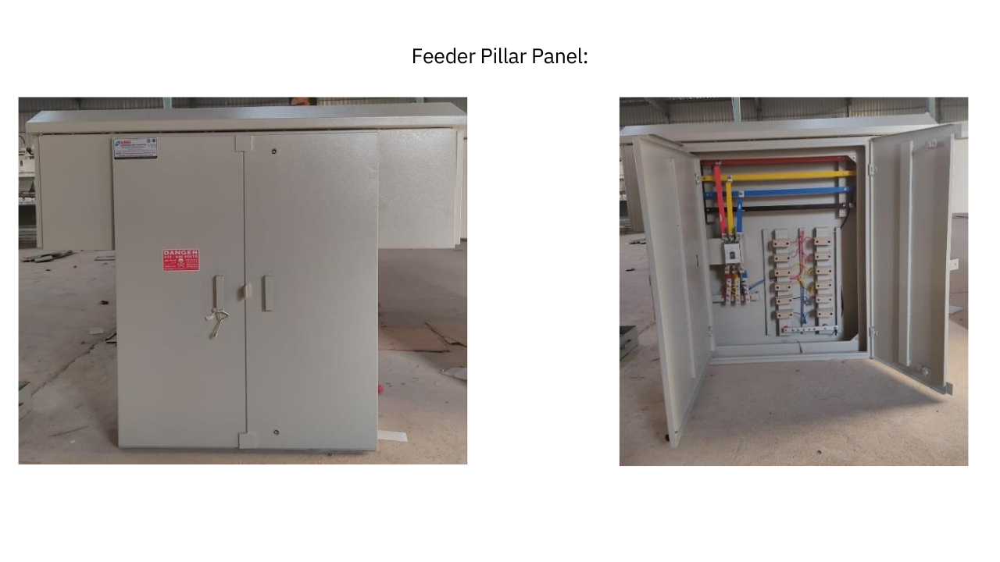

# Outdoor Feeder Panel : Robust and Reliable

During my internship at Abhi Controls & Coatings i got a chance to work on Industry level project (Outdoor Feeder Panel). This distribution panel is designed to handle a 125A incoming load and distribute it efficiently to 12 outgoing circuits, each rated at 32A. It is engineered to meet the IPX4 series protection standards, ensuring durability and safety in various environments.
# FEEDER PANEL AFTER ASSEMBLY

## Tech Stack

**Pannel Power flow:** BYPass Circuit / Parallel flow

**Installation:** Outdoor Installation

## Features

- Incoming Load Capacity: 125A

- Outgoing Circuits: 12 circuits, each rated at 32A

- Protection Standard: IPX4 series, providing protection against water splashes

- Busbar Design: Optimized for efficient current distribution and minimal voltage drop

# Switchgears:
- INCOMMER: 125A MCCB (Moulded case circuit breaker) is used as main breaker according to the load calculation & design constrains
- OUTGOING: 32A KIT KAT Fuse (Re-wireable fuse ) is used for outgoing circuits as protective device

# Enclosure 
- Enclosure houses all the components of the panel made of **16mm MS SHEET** & **Powder coated with SIMENS GRAY** 

# FEEDER PANEL GA DIAGRAM & SLD

# Busbar Design and Current Capacity
## Main Incomer Busbar
The main incomer busbar is constructed using a 25mm x 10mm aluminum bar, capable of handling the full 125A incoming load. This configuration ensures:

- High Current-Carrying Capacity
- Minimal Heat Buildup
- Robust Performance

## Outgoing Busbar
The outgoing busbars distribute power to the 12 individual 32A circuits and are made from 20mm x 10mm aluminum bars, providing:

- Safe Current Density
- Efficient Distribution
- Durability:
 # FEEDER PANEL BLOCK DIAGRAM

  

## Bypass Busbar
The bypass busbar, also rated at 125A, facilitates seamless integration with other electrical systems:

- Easy Connectivity: Allows for straightforward connection and parallel operation with adjacent panels.
- Enhanced Flexibility: Supports modular expansion and adaptability within complex power distribution networks.
- Reliable Performance: Designed to handle full load capacity without compromising safety or efficiency.

  # BY PASS POWER FLOW IN BLOCK DIAGRAM

# Power Bypass
## The power bypass feature offers:

- Seamless Integration: Simplifies connection to adjacent panels and expands distribution capabilities.
- Simplified Installation: Reduces complexity during setup and enhances overall system modularity.
- Improved Infrastructure Integration: Ensures compatibility within broader electrical systems and networks.
## Project outcomes

- **Gained Corporate Project Experience** 

- **Enhanced Communication Skills**

- **Leveraging CAD and Switchgear Expertise**
